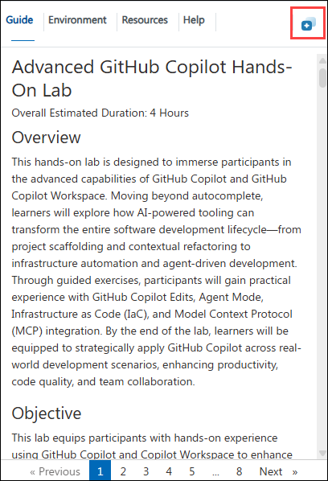
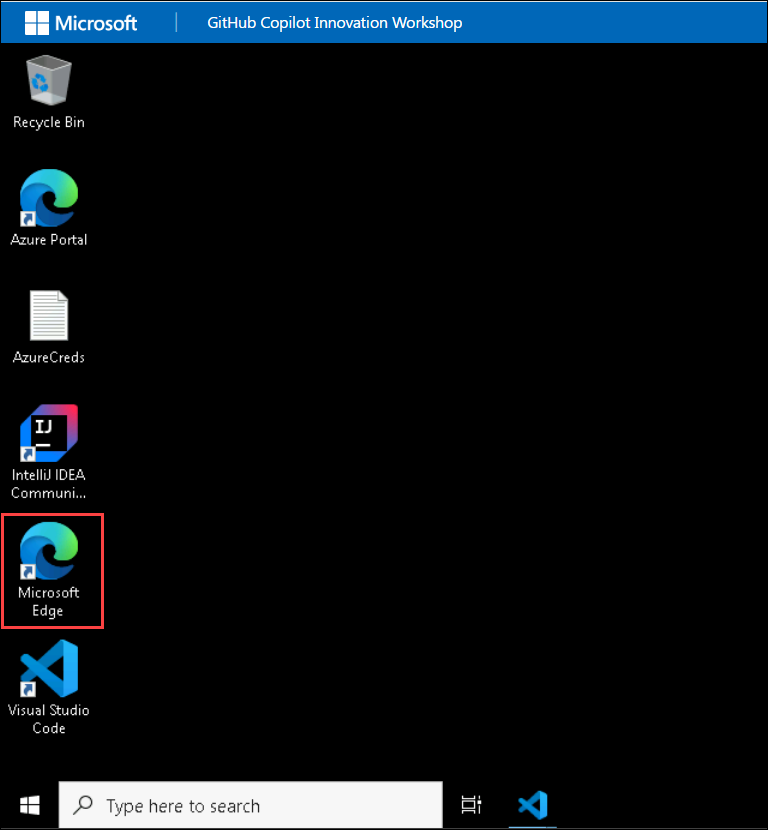
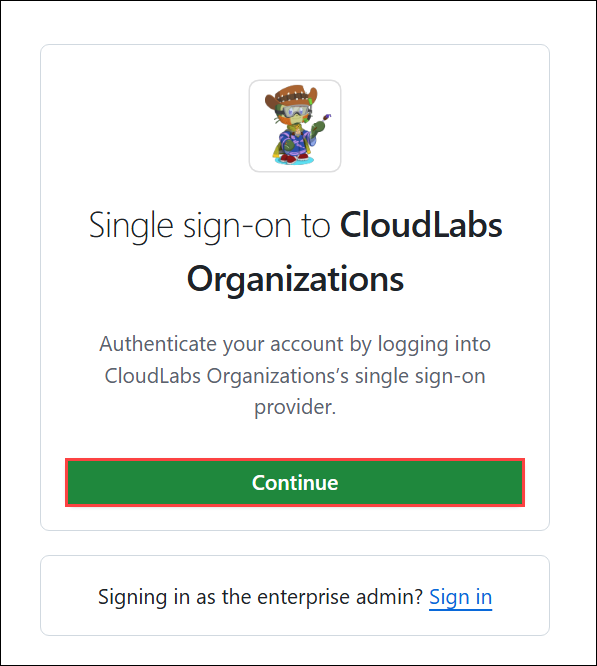
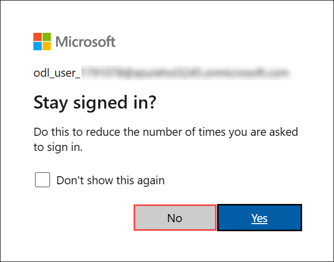

# Advanced GitHub Copilot Hands-On Lab

#### Overall Estimated Duration: 4 Hours

## Overview

This hands-on lab is designed to immerse you in the advanced capabilities of GitHub Copilot. Moving beyond autocomplete, you will explore how AI-powered tooling can transform the entire software development lifecycle—from project scaffolding and contextual refactoring to infrastructure automation and agent-driven development.

Through guided exercises, you will gain practical experience with GitHub Copilot Edits, Agent Mode, Infrastructure as Code (IaC), and Model Context Protocol (MCP) integration. By the end of the lab, you will be equipped to strategically apply GitHub Copilot across real-world development scenarios, enhancing productivity, code quality, and team collaboration.

## Objective

This lab equips you with hands-on experience using GitHub Copilot to enhance software development workflows. You will explore advanced features such as Agent Mode, Copilot Edits, Infrastructure as Code generation, and Model Context Protocol integration. 

By the end of this lab, you will be able to:

- Create and manage projects using GitHub Copilot.
- Apply GitHub Copilot Edits for multi-line and contextual code refactoring.
- Prompt Copilot effectively to generate complete API endpoints and scaffold web applications.
- Explore the Agent Mode in GitHub Copilot and understand its benefits over Ask Mode.
- Build a functional micro-application using Agent Mode for task-driven development.
- Use GitHub Copilot to author Infrastructure as Code (IaC) scripts with tools like Terraform and Bicep.
- Integrate Model Context Protocol (MCP) to create richer, contextual prompts for more accurate and targeted AI assistance.

## Architecture

The architecture of **Advanced GitHub Copilot Capabilities** goes beyond simple suggestions to act as a full **AI-driven development assistant** across the software lifecycle. At its core, **GitHub Copilot** enables **project scaffolding** for collaborative development. It provides **Copilot Edits** for contextual refactoring and generating features like **API WebApps**, enhanced by the **Model Context Protocol (MCP)** for richer prompts. In parallel, it supports **Infrastructure as Code (IaC)** with Terraform or Bicep, while integrating with **GitHub Web** for seamless editing, versioning, and deployment. Together, these features streamline **code creation**, **infrastructure automation**, and **application scaffolding** in a unified ecosystem.

## Getting Started with the Lab

Welcome to your Advanced GitHub Copilot Hands-On Lab! We've prepared a seamless environment for you to explore and learn GitHub Copilot Services. Let's begin by making the most of this experience:

## Accessing Your Lab Environment
 
Once you're ready to dive in, your virtual machine and **Guide** will be right at your fingertips within your web browser.
   
   

### Virtual Machine & Lab Guide
 
Your virtual machine is your workhorse throughout the workshop. The lab guide is your roadmap to success.

## Exploring Your Lab Resources

To get a better understanding of your lab resources and credentials, navigate to the **Environment** tab.

   

## Utilizing the Split Window Feature

For convenience, you can open the lab guide in a separate window by selecting the **Split Window** button from the top right corner.



## Managing Your Virtual Machine

Feel free to **Start**, **Stop**, or **Restart** your virtual machine as needed from the **Resources** tab. Your experience is in your hands!


## Utilizing the Zoom In/Out Feature

To adjust the zoom level for the environment page, click the A↕: 100% icon located next to the timer in the lab environment.


## Login to GitHub

1. In the LABVM desktop, open the **Microsoft Edge** browser.

   

1. In a new tab, navigate to the **GitHub login** page by copying and pasting the following URL into the address bar:

   ```
   https://github.com/login
   ```

1. On the **Sign in to GitHub** tab, enter the provided **GitHub username** **(1)** in the input field, and click on **Sign in with your identity provider** to continue **(2)**.

    - Email/Username: <inject key="GitHub User Name" enableCopy="true"/>

      

1. Click on **Continue** on the **Single sign-on to CloudLabs Organizations** page to proceed.

    

1. You'll see the **Sign in** tab. Here, enter your Azure Entra credentials:

   - **Email/Username:** <inject key="AzureAdUserEmail"></inject>

       

1. Next, provide your password and click on **Sign in**

   - **Password:** <inject key="AzureAdUserPassword"></inject>

      

1. On the **Stay Signed in?** pop-up, click on No.

    

1. You are now successfully logged in to **GitHub** and have been redirected to the **GitHub homepage**.

   

1. On the **Create a new repository** tab, most fields will be pre-filled. Just update the **Owner** to **Cloudlabs-Enterprises** **(1)**, change the **Repository name** **(2)** as provided below to make it unique.

    - Enter your Repository name as: **invoice-api-<inject key="Deployment-id" enableCopy="false"/>**

      

    - Slide the **Add README** configuration toggle **On**

    - Then click **Create repository** **(3)** to continue

      

1. After your new repository is created, wait about 20 seconds and then refresh the page; you will be redirected to the main page of the **invoice-api-<inject key="Deployment-id" enableCopy="false"/>**  repository.

      

1. Once the repository is created, click on your profile picture in the top right corner and then select **Organizations** under the settings section.

      

1. On the GitHub **Settings** page, under the **Code, planning, and automation** section, click **Codespaces** from the left pane to view and manage your Codespace.

      

1. Scroll down and make sure, **Visual Studio Code** is selected, under the **Editor preference**.

     
   

## Support Contact

The CloudLabs support team is available 24/7, 365 days a year, via email and live chat to ensure seamless assistance at any time. We offer dedicated support channels tailored specifically for both learners and instructors, ensuring that all your needs are promptly and efficiently addressed.

Learner Support Contacts:

- Email Support: cloudlabs-support@spektrasystems.com
- Live Chat Support: https://cloudlabs.ai/labs-support

Now, click on Next from the lower right corner to move on to the next page.


### Happy Learning!!
