# Lab 01: Getting Started (Setup & Context)

#### Duration : 20 minutes

### Lab Overview:

In this foundational exercise, participants will set the stage for the lab by reviewing Copilot enablement and billing essentials, 
accessing GitHub Codespaces, and configuring their development environment. They'll explore the provided repository, select a preferred programming 
language, and familiarize themselves with the project structure. The scenario centers on enhancing a shopping website. By the end of this session, learners will have a clear understanding 
of the lab’s goals, the technical setup required, and the real-world context driving the hands-on experience.

### Lab Objectives:
Establish the lab environment, understand the administrative context of Copilot Enablement and Billing, and frame the project scenario for hands-on development. By the end of this lab, participants will complete the following tasks:

1. Task 1: Review Admin for GitHub Copilot Enablement & Billing
2. Task 2: Access GitHub Codespaces & Set Up Lab Environment
3. Task 3: Review Repo & Select Language
4. Task 4: Frame the Scenario  

### Task 1: Review Admin for GitHub Copilot Enablement & Billing

This task equips participants with foundational knowledge and administrative skills to enable, configure, and manage GitHub Copilot—including **Copilot for Business** and **Copilot Enterprise**—within an organization.

**Understand GitHub Copilot Licensing**

GitHub Copilot is licensed **per user**, and is available through the following SKUs:

| SKU                    | Description                                                                 |
|------------------------|-----------------------------------------------------------------------------|
| **Copilot Business** | For organizations: includes centralized policy controls and team management. |
| **Copilot Enterprise** | Provides additional premium requests, access to additional models, the ability to create Copilot knowledge bases, and access to GitHub Spark. |

- You can view the assigned Licenses by navigating to your organization **Settings** and **Copilot > Features**. 

  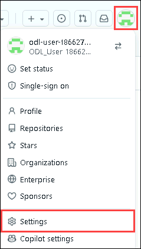

  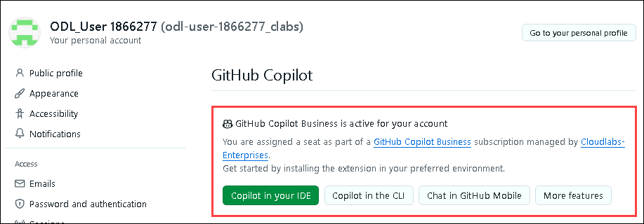

>  *Note:* Both **Copilot for Business** and **Copilot Enterprise** support centralized billing, policy enforcement, and user provisioning.

**Configure GitHub Copilot Access**

To enable and configure Copilot access:

- Navigate to **Enterprise > Billing and licensing > Licensing** and click on the **Manage** button for **Copilot**
- Assign licenses to:
  - All organization members
  - Specific teams or individual users
- Navigate to **Organization > Settings > Copilot > Coding agent**
- Set **repository access policies** to control what code Copilot can reference:
  - No repositories
  - All repositories
  - Only selected repositories

**Assign Users & Manage Access**

User provisioning and license assignment can be done via:

- **GitHub Enterprise Admin Console (as shown previously)**
- **Organization Settings > Copilot > Access**

Best practices:
- Use **Teams** to bulk-assign Copilot access
- Monitor activation and usage via the enterprise-level view shown previously

**Billing & Cost Management**

- Billing is **monthly**, based on active users
- View invoices and usage under **Billing and licensing** at the enterprise level
- Click **Copilot > View details > Get usage report** and use the information to track:
  - Adoption trends
  - ROI metrics
  - License utilization

> Consider removing licenses for inactive users to reduce costs.

### Task 2: Access GitHub Codespaces & Set Up Lab Environment

In this task, participants will prepare their technical workspace.

1. Navigate back to the home page of your repository by clicking the **Code** **(1)** tab located at the top left of the screen. Click the **Code** **(2)** button located in the middle of the page. 

   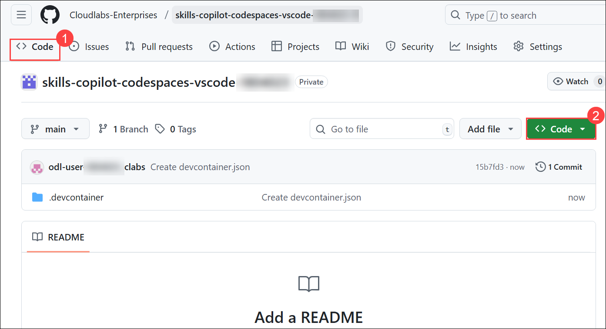

1. Click the **Codespaces (1)** tab on the box that pops up and then click the **Create codespace on main (2)** button.  If you don't see the "Create Codespace" button, it likely means your repository wasn't created under the **Cloudlabs-enterprises** organization. To fix this, either delete your current repository and recreate it under the specified organization or fork the existing repository into the **Cloudlabs-enterprises** Org.

   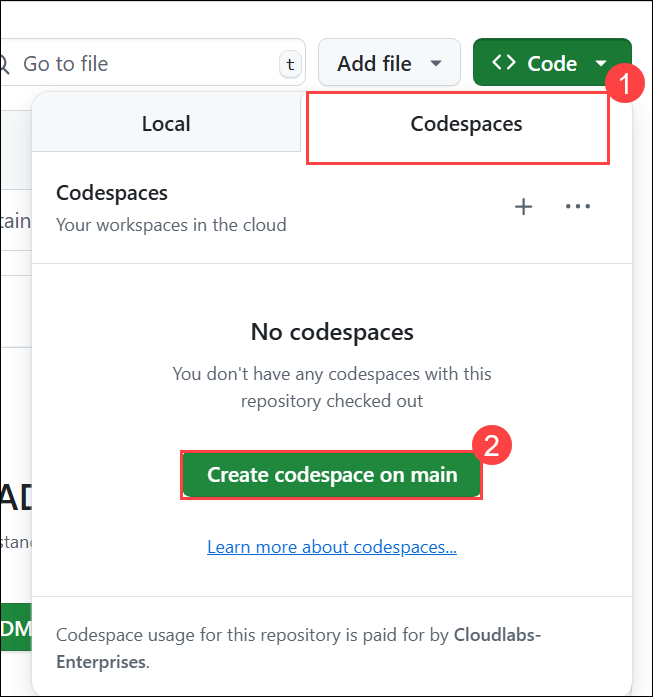

1. You will encounter a pop-up prompt: **This site is trying to open Visual Studio Code.** Click **Open** to proceed. Subsequently, another pop-up window will appear within Visual Studio Code (VS Code), where you should select **Install Extension and Open URI** to continue.

    >**Note**: If a pop-up prompt doesn't appear in the browser to open Visual Studio Code, manually launch Visual Studio Code from the desktop and close it. Next, return to the browser, refresh the page, and launch the codespace that was previously created.

    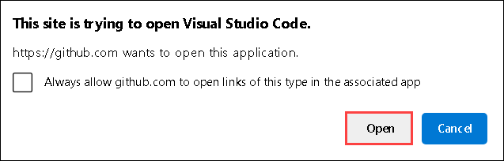

    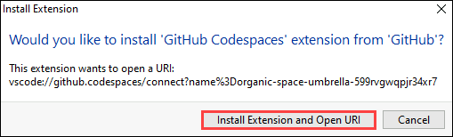

    >**Note**: Click on **Allow** if "The extension **Github Codepsaces** wants to sign in using GitHub" pop-up appears.

      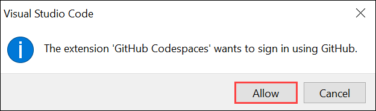

1. On **Select user to authorize Visual Studio Code** page click on **Continue** 

    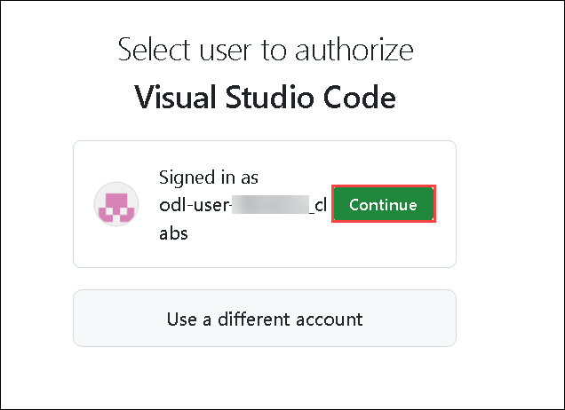

      >**Note:** If you get an error connecting to the browser like "this page isn't working right now, 127.0.0.1 didn't send any data," close the browser window and then, in VS Code, click on **Cancel** and select **Yes** to try a different method. It will redirect you to a new page for authentication. You may need to try this a couple of times to sign in to Copilot. 

1. On the **Visual Studio Code is requesting additional permissions** tab, click **Authorize Visual-Studio-Code**.

    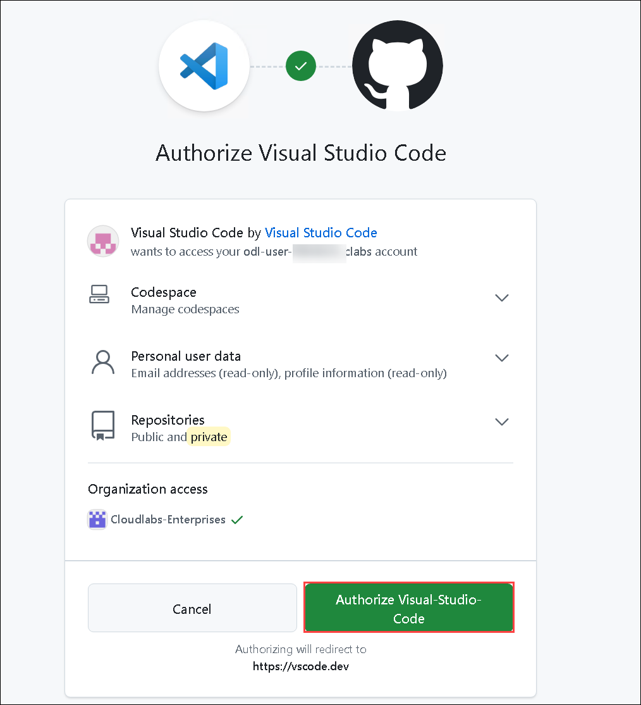

1. On the **This site is trying to open Visual Studio Code** pop-up, click **Open** to launch VS Code via vscode.dev.

    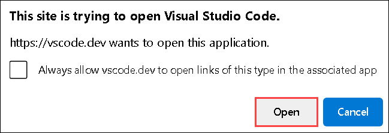

1. You are now signed-in to your GitHub account in Visual Studio Code. Click on the **GitHub Copilot** icon from the top and select **Ask** from the dropdown.

    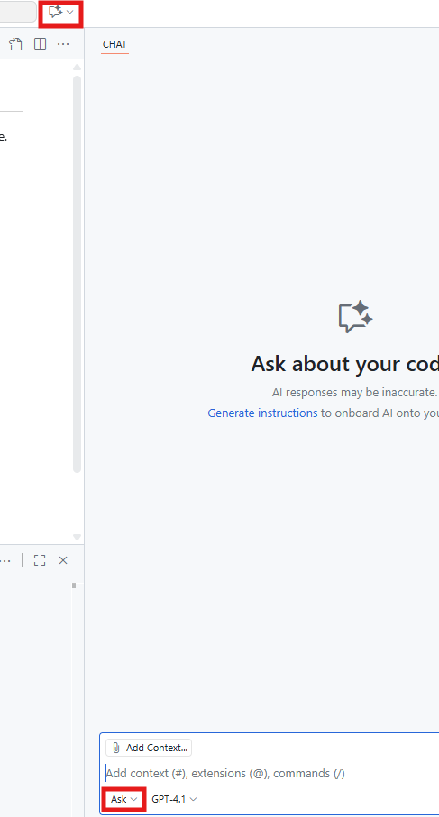

### Task 3: Review Repo & Select Language

In this task, participants will explore their scaffolded repository, understand the lab’s technical and instructional goals, and choose their preferred development language—either **TypeScript (React/Vite)**, **TECH STACK 2**, **TECH STACK 3**, or **TECH STACK 4**. They'll use **Copilot Ask Mode prompts** to review their environment.

**Explore the Project Structure**

Encourage learners to open their repo in Visual Studio Code and inspect the folder layout. If desired, they can ask Copilot to explain the purpose of each file and folder in the repository.

  
Need a hint? Try this prompt.

  @workspace Walk me through the structure of this repository. Explain the purpose of each folder and file.

**Choose Your Development Language**

Participants now select their preferred stack:

| Language              | Use Case                         | Strengths                                    |
|-----------------------|----------------------------------|----------------------------------------------|
| **TypeScript**        | TBD                              | TBD                                          |
| **LANGUAGE 2**        | TBD                              | TBD                                          |
| **LANGUAGE 3**        | TBD                              | TBD                                          |
| **LANGUAGE 4**        | TBD                              | TBD                                          |

Ask Copilot for guidance on how to configure your environment for your chosen stack.

  
Need a hint? Try this prompt.

  @workspace I want to work in [CHOSEN TECH STACK]. Help me configure my environment and update any launch settings or dependencies accordingly.

Follow the guidance provided by Copilot for configuring your environment.

### Task 4: Frame the Scenario

This task will help to define the real-world challenge and success criteria for enhancing the chosen application using GitHub Copilot. Participants will apply Copilot to refactor code, automate tasks, and improve the developer experience.

#### Scenario Context

You have just moved onto a project for developing a shopping website for a local grocery store. The previous developers failed to deliver an application with all of the required features and did not perform any testing. Your team has adopted **GitHub Copilot** to accelerate development, improve onboarding, and automate boilerplate tasks.

#### Development Challenge

Your mission is to:

- Refactor code for clarity and maintainability  
- Add meaningful documentation
- Generate unit tests to reach 80%+ code coverage  
- Automate repetitive logic like error handling and data validation  
- Use GitHub.com features (PR review, issue implementation, summaries)  
- Apply custom instructions to tailor Copilot’s tone and priorities

Using the following Copilot features:
- Code Editing
- Agent Mode
- Agentic Coding
- MCP
- Customizing Copilot